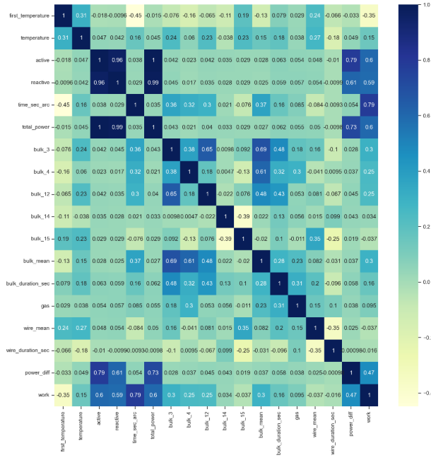
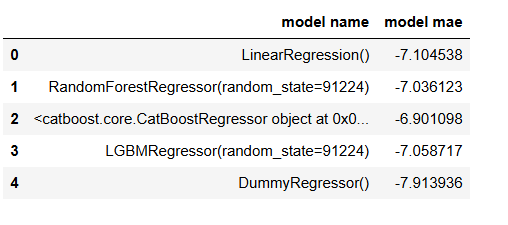

# Проект индустрии

Описание работы:
----

Чтобы оптимизировать производственные расходы, металлургический комбинат «Стальная птица» решил уменьшить потребление электроэнергии на
этапе обработки стали. Для этого комбинату нужно контролировать температуру сплава. Ваша задача — построить модель, которая будет её предсказывать. 
Заказчик хочет использовать разработанную модель для имитации технологического процесса. Ниже расскажем о деталях этого процесса. 
Их важно знать, прежде чем генерировать новые признаки. Описание этапа обработки

Сталь обрабатывают в металлическом ковше вместимостью около 100 тонн. Чтобы ковш выдерживал высокие температуры, 
изнутри его облицовывают огнеупорным кирпичом. Расплавленную сталь заливают в ковш и подогревают до нужной температуры графитовыми электродами. 
Они установлены в крышке ковша. Из сплава выводится сера (этот процесс — десульфурация), добавлением примесей корректируется химический 
состав и отбираются пробы. Сталь легируют — изменяют её состав — подавая куски сплава из бункера для сыпучих материалов или проволоку через 
специальный трайб-аппарат (от англ. tribe — «масса»). Перед тем как первый раз ввести легирующие добавки, измеряют температуру стали и 
производят её химический анализ. Потом температуру на несколько минут повышают, добавляют легирующие материалы и продувают сплав инертным газом. 
Затем его перемешивают и снова проводят измерения. Такой цикл повторяется до достижения целевого химического состава и оптимальной температуры 
плавки. Тогда расплавленная сталь отправляется на доводку металла или поступает в машину непрерывной разливки. 
Оттуда готовый продукт выходит в виде заготовок-слябов (от англ. slab — «плита»).

Требования заказчика:
----

Модель должна предсказывать последнюю температуру в ковше.

При оценке качества модели использовать метрику: МАЕ.

Получить МАЕ 7 или меньше.

Ввиду особенностей производства дать модель не должна быть сильно чувствительна к выбросам.

Описание данных
----

Данные состоят из нескольких файлов, полученных из разных источников:

data_arc_new.csv — данные об электродах;

data_bulk_new.csv — данные о подаче сыпучих материалов (объём);

data_bulk_time_new.csv — данные о подаче сыпучих материалов (время);

data_gas_new.csv — данные о продувке сплава газом;

data_temp_new.csv — результаты измерения температуры;

data_wire_new.csv — данные о проволочных материалах (объём);

data_wire_time_new.csv — данные о проволочных материалах (время).

План работ:
----

1. Загрузка данных Нахождение ошибок и пропусков. Обшее ознокомление с данными

2. Исследовательский анализ и предобработка данных Исправления выявленных ошибок и формирования новых признаков м визуилизацией и анализом данных

3. Объединение данных Объединение данных

4. Исследовательский анализ и предобработка данных объединённого датафрейма. Для обьедененой таблицы

5. Подготовка данных Разделение на обучающую и тестовую выборку. Масштабирование данных

6. Обучение моделей машинного обучения. Требуется обучить минимум 2 модели (обучим 4 ниже стоящих модели). 
    
    6.1  LinearRegression

    6.2 RandomForestRegressor

    6.3 CatBoostRegressor

    6.4 LGBMRegressor

7. Выбор лучшей модели

8. Общий вывод и рекомендации заказчику

Вывод:
---

**Результаты анализа и подготовки данных**

В таблице об электродах

В датфрейме data_arc исправили названия столбцов. Посчитали разницу времени начало и конца. По формуле добавили полную мощьность .Тем самым добавили новыйе признык. 
Удалили не нужные столбцы. Явных дубликатов не обнаружено. Во всех столбцах имеются выбросы. 
В реактивных имелось не аномальное значение (удалили аномалию).

В таблице сыпучих материалов (data_bulk).

Откорректировали названия столбцов. Удалили столбцы с большим числом пропусков. 
Во всех данных имеются выбросы в той или ной степени . 
Данные распределены не нормальным оброзом.

В таблице сыпучих материалов время (data_bulk_time).

Исправили название столбцов.
Привели данные в правильны формат. Удалили столбцы с большим числом пропусков и добавили 
новыей пизныки максимального и минимального времени добовления материала и длительность по 
времени когда добовляли.

В таблице газ (data_gas)

Исправили название столбцов.

В таблице температуры (data_temp)

Откорректировали названия столбцов, удалили все пропуски. Привели данные в правильный формат.
Удалили аномальные значения. 

В таблице проволочных материалов (data_wire)

Исправили названия столбцов. Добавили новый признык

В таблице проволочных материалов время подачи (data_wire_time)

Исправили названия столбцов. Создали новые призныки. 

**Анализ и обработка объединеного датафрейма**

Из 7 исходных таблиц, нами была получена единая сводная таблица по значению key. Таблица содержит в себе 2500 записей и 
15 столбцов + 1 столбец целевой признык.

В обьедененом датафрейме

Добавили два новых призныка. 

Выявили столбцы total_power, reactiva, active. Имеющие высокий уровень кореляции.
Удалили активных и реактивных столбцов. 

Мультиколениальность была устронена

**Подготовка и обучение модели**

Разедили данные 75% обучаюшяя; 25 % тестовая.

Масштабировали данные.

Обучили модели (с подборкой гиперпараметров). 

**Результат обучения моделей** 

Наиболее лучший показатель имеется показал catboost. 
С параметрами Best parameters: {'depth': 6, 'iterations': 100, 'learning_rate': 0.1}

Так же на тестовой выборке используя алгоритм catboost была получена точность в 6.8 что соответсвует условию заказчика.

Обзор влияние важности призныко лучшей модели.

Было выявлено что больше всего на алгоритм влияет следующие параметры.

first_temperature : первая измеренная температура в партии

time_sec_arc : продолжительность нагрева

bulk_12 - 12 объем подоваемого маттериала

wire_mean - средний объем подачи проволки

wire_duration_sec - продолжительность подачи проволки по времени

Рекомендации
----
Заказчику можно посоветовать уделять больше внимания первому замеру Температуры , 
продолжительности нагрева , обьему подоваемого материала и обьему подоваемой проволки и так 
же длительности по времени падачи проволки

​

Код находится в файле 
prediction_last_temperature.ipynb
---
